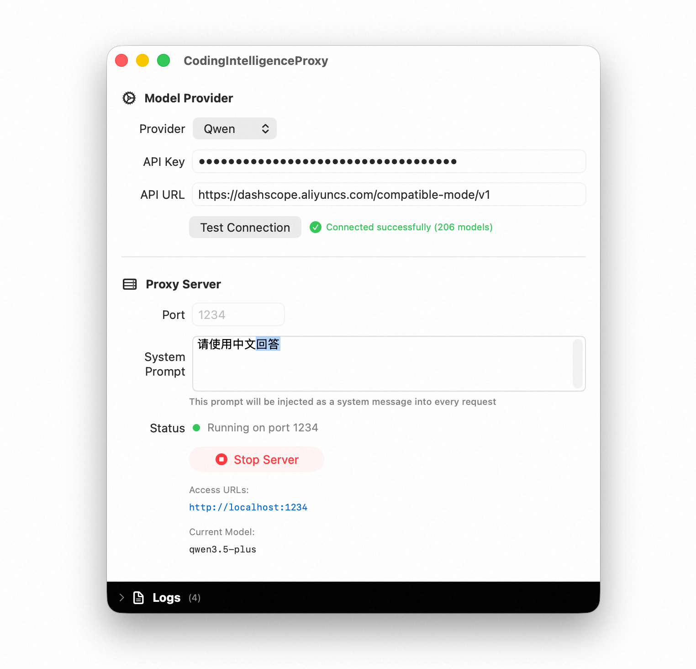
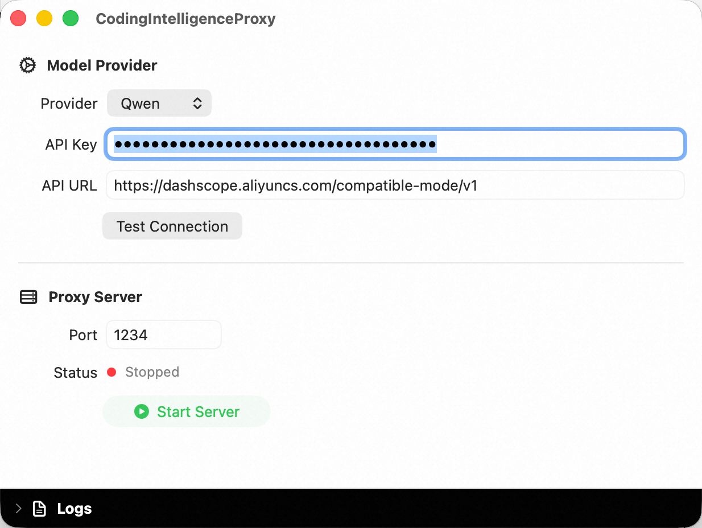
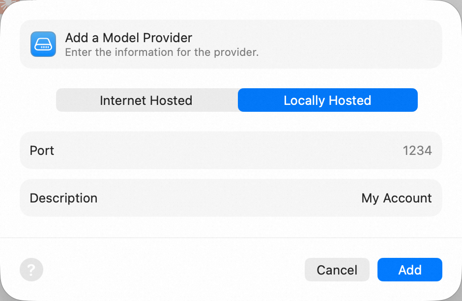
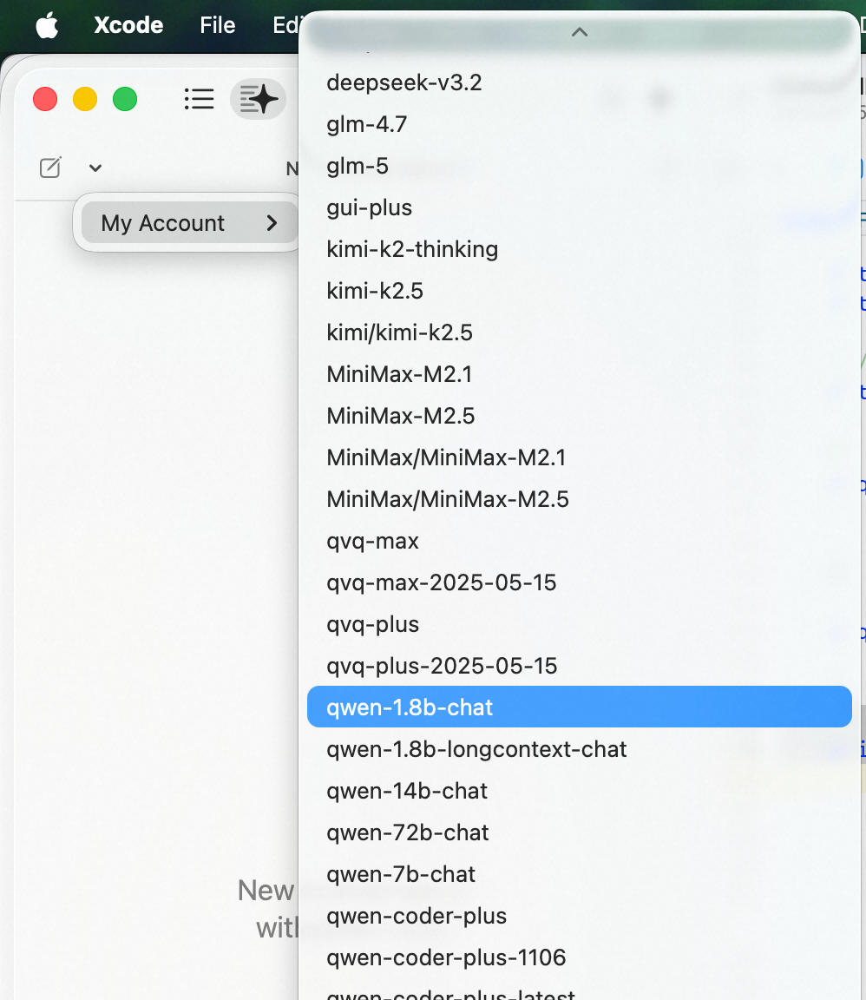

# CodingIntelligenceProxy

> [English](README.md) | 中文

CodingIntelligenceProxy 是一款 macOS 应用，它作为代理服务器，让 Xcode 的智能编码功能（Apple Intelligence / Predictive Code Completion）可以接入第三方 AI 模型服务。

## 支持的 AI 服务商

- 智谱AI (ZhipuAI)
- Kimi (Moonshot)
- Gemini
- 通义千问 (Qwen)
- 自定义 (Custom) — 任何兼容 OpenAI API 的服务

## 使用步骤

### 步骤一：配置 API 并启动代理服务器

1. 打开 CodingIntelligenceProxy 应用
2. 选择 AI 服务商（Provider）
3. 输入你的 **API Key** 和 **API URL**
4. 点击 **Start Server** 启动代理服务器（默认端口 `1234`）

### 步骤二：在 Xcode 中添加模型服务

1. 打开 **Xcode → Settings → Intelligence**
2. 点击 **Add a Model Provider**
3. 选择 **Locally Hosted**
4. 在 Port 中输入步骤一中设置的端口号（默认 `1234`）
5. 点击 **Add**

### 步骤三：选择模型

在 Xcode 编辑器中，选择你要使用的 AI 模型。

### 步骤四：开始使用

现在你可以在 Xcode 中正常使用智能编码功能了。代理服务器会将 Xcode 的请求转发到你配置的 AI 服务商。
